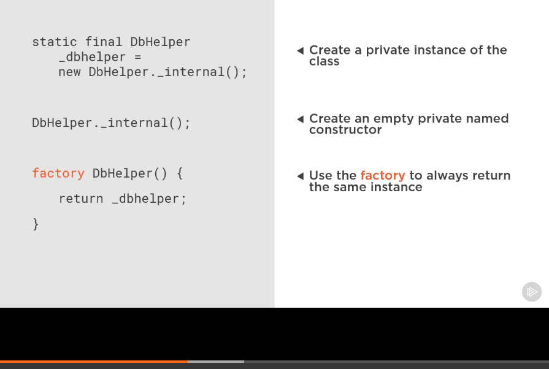
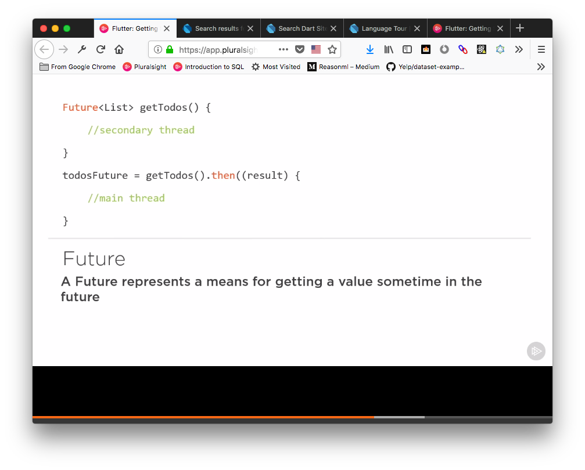
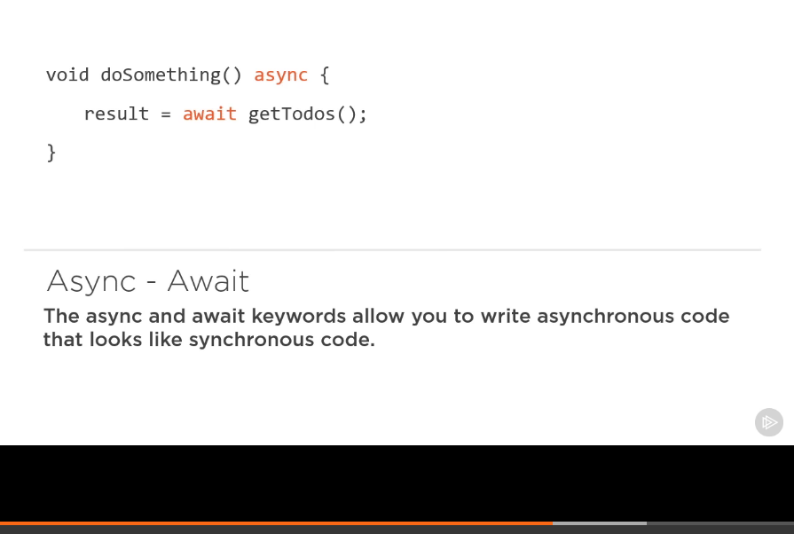

# todo_app

A new Flutter project.

## Database Class

Install deps from [package manager](https://pub.dartlang.org/packages/) [sqflite](https://pub.dartlang.org/packages/sqflite), [path_provider](https://pub.dartlang.org/packages/path_provider), [intl](https://pub.dartlang.org/packages/intl) by adding them to pubspec.yml

## Using Raw SQL

These methods are interchangeable and operate asynchronously.

```sql
db.rawQuery("SELECT * FROM yourTable" );

db.rawInsert('INSERT INTO yourTable(name, num)
    VALUES("some name", 1234)');

db.rawUpdate('UPDATE yourTable SET name = ?,
    WHERE name = ?', ["new name", "old name"]);

db.rawDelete('DELETE FROM yourTable WHERE id = 1');
```

## Using [SQFLite](https://pub.dartlang.org/packages/sqflite) Helpers

```dart
db.update('yourTable',
    yourObject.toMap(),
    where: "$colId = ?",
    whereArgs: [yourObject.id]);
```

## Adding to pubspec.yml

Go to `pubspec.yml` and list the dependencies. Use version 0.15.7 for intl

```yml
dependencies:
  flutter:
    sdk: flutter
  sqflite: any
  path_provider: any
  intl: ^0.15.7
```

## DBHelper for accessing the sqldb

Create class for db declaring our tables and columns, so String tblTodo = "todo" declars tbleTodo as string type and sets it todo which is the name or table. Same idea for columns.

```dart
 class DbHelper {
   String tblTodo = "todo";
   String colId = "id";
   String coltitle = "title";
   String colDescription = "description";
   String colPriority = "priority";
   String colDate = "date";
 }
```

Since we only want this class to be called once, so we need to turn it into a singleton. Singleton restricts the instantiation of a class to one object only.
So basically you can't call DbHelper more than once in your program. Instead of creating a new instance the factory constructor is only required to return one instance of the class.
Note: `factory` where dartlang's factory constructor lets you override the default behaviour, which is not singleton, and use the class as a singleton.

### How it works:



```dart
class DbHelper {
    <!-- create DbHelperClass called dbHelper with an underscore to mark as private -->
    static final DbHelper _dbHelper = DbHelper._interal();
    String tblTodo = "todo";
    String colId = "id";
    String coltitle = "title";
    String colDescription = "description";
    String colPriority = "priority";
    String colDate = "date";
<!-- named constructor -->
    DbHelper._internal();
<!-- unnamed constructor returning _dbHelper -->
    factory DbHelper(){
        return _dbHelper;
    }
}
```

## Async/Await/Futures

These methods are interchangeable in dartlang.

**Futures**


**Async/Await**

